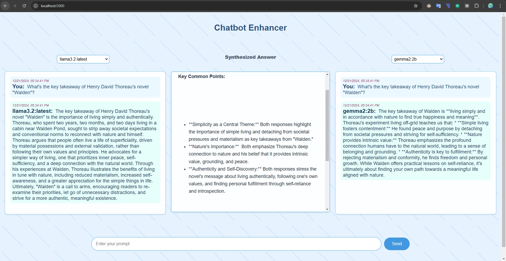

# Chatbot Enhancer

This is a web application that allows you to compare responses from 2 different LLM models side by side, and then summarize their common points into a synthesized answer. With this method, it can allelivate the effect of signle model's hullicinaiton and give you a more accurate answer to your prompt.

## Features

- **Dual Model Comparison**: Compare responses from two different LLM models simultaneously
- **Real-time Streaming**: Watch responses generate in real-time
- **Automatic Synthesis**: Automatically identifies and summarizes common points between 2 responses with a third LLM that is specialized in text analysis and summarization. 
- **Model Selection**: Choose from available Ollama models via dropdown menus
- **Token Management**: Use system prompt to enforces a 300-token limit for consistent, concise responses
- **Clean Interface**: Simple, intuitive UI for easy interaction

## Prerequisites

- Python 3.10
- Flask
- Ollama installed and running locally
- Required Python packages (see requirements.txt)

## Setup

1. Clone the repository:

git clone https://github.com/maverick001/chatbot-enhancer.git

    cd chatbot-enhancer

2. Install dependencies:

    pip install -r requirements.txt

3. Make sure Ollama is running locally on port 11434

4. Start the Flask server:

    python backend.py

5. Open your browser and navigate to:
http://localhost:5000

## Usage

1. Select your desired models from the dropdown menus on both sides
2. Enter your prompt in the input field at the bottom
3. Click "Send" to generate responses
4. View the responses stream in real-time in the side panels
5. Read the synthesized analysis in the center panel, which includes:
   - Key common points between both responses
   - A synthesized summary of the shared insights

## Technical Details

- Backend: Flask (Python)
- Frontend: HTML, CSS, JavaScript
- LLM Integration: Ollama API
- Streaming Support: Server-Sent Events (SSE)
- GPU Acceleration: Enabled by default

## License

MIT License

## Contributing

Contributions are welcome! Please feel free to submit a Pull Request.